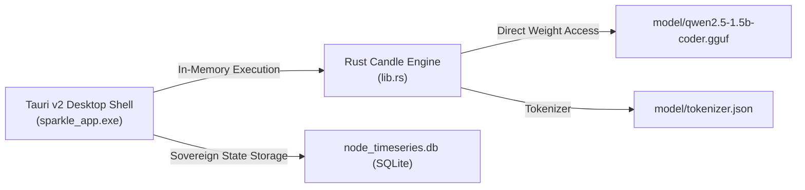

# Adaptive Neural Network & Błyskawica / SPARKLE V10

[](https://github.com/V1B3hR/adaptiveneuralnetwork/actions)


> **SPARKLE / Błyskawica V10**: Zogniskowana przestrzeń robocza AI do myślenia, kodowania i kolaboracji — zasilana żywym rdzeniem kognitywnym w architekturze **Full Standalone Offline AI**.
>
> A biologically inspired adaptive neural network framework with vectorized phase dynamics, paired with the SPARKLE standalone offline AI desktop shell powered by native Rust Candle inference.

---

## ⚡ Quick Navigation

- [🚀 Quick Start](#-quick-start)
- [🌟 Evolution & Development Phases Matrix](#-evolution--development-phases-matrix)
- [💎 Key Achievements & Features](#-key-achievements--features)
- [⚙️ Błyskawica / SPARKLE V10 Standalone Desktop Setup](#️-błyskawica--sparkle-v10-standalone-desktop-setup)
- [🧪 Testing & Quality](#-testing--quality)
- [📚 Documentation Directory](#-documentation-directory)
- [⚡ Nasza Wspólna Przygoda (Antigravity & V1B3hR)](#-nasza-wspólna-przygoda-antigravity--v1b3hr)

---

## 🚀 Quick Start

Get started in 5 minutes with our [Quick Start Guide](QUICKSTART.md) or use the unified CLI interfaces:

### Unified Configuration-Driven Training Interface

```bash
# Train using a configuration file
python train.py --config config/training/mnist.yaml

# Train with specific dataset and hyperparameters
python train.py --dataset mnist --epochs 20 --batch-size 128

# List all available datasets
python train.py --list-datasets

# Evaluate a trained checkpoint
python eval.py --checkpoint checkpoints/model.pt --dataset mnist
```

**Supported dataset domains:** `mnist`, `cifar10`, `annomi`, `mental_health`, `vr_driving`, `autvi`, `digakust`, `ibm_hr`, and synthetic fallbacks.

📖 **[Read the Script Consolidation Guide](docs/SCRIPT_CONSOLIDATION.md)** for full CLI parameter options.

---

### Python Framework Installation

```bash
# Clone the repository
git clone https://github.com/V1B3hR/adaptiveneuralnetwork.git
cd adaptiveneuralnetwork

# Install core in editable mode
pip install -e .

# Install with optional extensions (NLP, JAX, neuromorphic, multimodal, dev)
pip install -e ".[nlp,dev]"
```

---

## 🌟 Evolution & Development Phases Matrix

The repository has progressed through a rigorous 10-phase evolutionary roadmap, consolidating performance optimizations, cognitive modules, physical solvers, and offline desktop integration.

📖 **For full phase documentation and deep dives, visit the [Master Evolution & Phases Matrix](docs/phases/README.md).**

```mermaid
graph LR
    subgraph "Core Refactor & Performance"
        P0["Phase 0: Inventory & Baseline"] --> P1["Phase 1: Data Layer (+949%)"]
        P1 --> P2["Phase 2: Tensor Path Optimization"]
        P2 --> P3["Phase 3: Modular Architecture"]
        P3 --> P4["Phase 4: Unified Trainer & Callbacks"]
        P4 --> P5["Phase 5: DDP Parallelization"]
        P5 --> P6["Phase 6: Evaluation & Drift Detection"]
    end
    subgraph "Cognition & Physical Solvers"
        P6 --> P7["Phase 7: Deep Cognition (PINN, Cymatics, CRA)"]
        P7 --> P8["Phase 8: Hardening & Wolf Teeth Defense"]
        P8 --> P9["Phase 9: Hyper-Synthesis v4.0 (GR, EBM, Lava)"]
    end
    subgraph "Standalone Desktop"
        P9 --> V10["Phase V10: SPARKLE Desktop Shell (Rust Candle)"]
    end
```



| Phase | Title | Milestone / Outcome | Status | Documentation |
|---|---|---|---|---|
| **Phase 0** | Foundation & Inventory | Full baseline profiling, hotspot ranking, dependency mapping | ✅ Complete | [Phase 0 Guide](docs/phases/phase0_foundation/README.md) |
| **Phase 1** | Data Layer Rework | Vectorized collation, pinned memory prefetch, **+949% throughput** | ✅ Complete | [Phase 1 Guide](docs/phases/phase1_data_layer/README.md) |
| **Phase 2** | Core Tensor Path | Operation fusion, allocation churn reduction, contiguous memory | ✅ Complete | [Phase 2 Guide](docs/phases/phase2_tensor_path/README.md) |
| **Phase 3** | Modular Architecture | Layer registry, YAML/JSON configuration assembly, zero global state | ✅ Complete | [Phase 3 Guide](docs/phases/phase3_modular_arch/README.md) |
| **Phase 4** | Training Abstraction | Centralized `Trainer`, 9-hook lifecycle `CallbackList`, AMP, Grad Accum | ✅ Complete | [Phase 4 Guide](docs/phases/phase4_training_loop/README.md) |
| **Phase 5** | Parallelization | `DistributedTrainer`, PyTorch DDP, multi-GPU scaling, distributed sampler | ✅ Complete | [Phase 5 Guide](docs/phases/phase5_parallelization/README.md) |
| **Phase 6** | Evaluation & Validation | Microbenchmarks, drift detection (Z-score), deterministic eval | ✅ Complete | [Phase 6 Guide](docs/phases/phase6_evaluation/README.md) |
| **Phase 7** | Deep Cognition | PINN thermal engine, Diamond Yant cymatics, neurochemistry, CRA engine | ✅ Complete | [Phase 7 Guide](docs/phases/phase7_deep_cognition/README.md) |
| **Phase 8** | System Hardening | Wolf Teeth immune shield, single-shell Tauri ADR, Nethical 25 laws | ✅ Complete | [Phase 8 Guide](docs/phases/phase8_hardening_security/README.md) |
| **Phase 9** | Hyper-Synthesis v4.0 | 625-node matrix, GR geodesic solver, EBM climate, Lava compiler, KEGG | ✅ Complete | [Phase 9 Guide](docs/phases/phase9_hyper_synthesis/README.md) |
| **Phase V10**| SPARKLE Desktop Shell | Full standalone offline AI (Rust Candle SLM in Tauri v2, SQLite vault) | ✅ Complete | [Phase V10 Guide](docs/phases/v10_standalone_shell/README.md) |

---

## 💎 Key Achievements & Features

### 1. 🧬 Biologically Inspired Phase Dynamics
Nodes dynamically transition through **ACTIVE**, **SLEEP**, **INTERACTIVE**, and **INSPIRED** phases. During the `SLEEP` phase, the system executes memory consolidation, synaptic EWC weight protection, and energetic restabilization.

### 2. ⚡ 100% Offline Autonomy & Physical Solvers
- **Relativistic Gravity Solver (GR)**: Numerical integration of geodesic orbits in Schwarzschild and Kerr spacetimes (`astrophysics_climate.py`).
- **Climatic Cybernetics (EBM)**: Non-linear stochastic Energy Balance Model with ice-albedo and methane feedback loops.
- **Cellular Metabolism**: Offline KEGG biochemical pathways database (`data/kegg_metabolic_pathways.json`) supporting flux balance analysis.
- **Lava Neuromorphic Compiler**: Compiles SNN topologies with hardware device emulation (`hardware_device_connected = True`).
- **PINN Thermal Engine**: Physics-Informed Neural Network solving 2D non-steady heat conduction PDEs (`pinn_thermal_engine.py`).

### 3. 🛡️ Immunological Defense & Ethical Governance
- **Wolf Teeth Shield**: 3-stage defense mechanism (honey-pot lures, sticky ooze rate-limiting, and glitch token dissolution).
- **Epistemic Defense**: Real-time detection and quarantine of ontological contradictions.
- **Nethical Framework**: 25 Fundamental Laws of AI ethics with formal mathematical proof verification.

### 4. 🧠 Unified Memory Consolidation
- **Phase-based Consolidation**: Sleep-state synaptic replay and reorganization.
- **Synaptic Consolidation**: Elastic Weight Consolidation (EWC) preventing catastrophic forgetting.
- **Episodic-to-Semantic Transfer**: Autonomous conversion of conversation memories into long-term structured knowledge schemas ([docs/summaries/CONSOLIDATION.md](docs/summaries/CONSOLIDATION.md)).

---

## ⚙️ Błyskawica / SPARKLE V10 Standalone Desktop Setup

Błyskawica V10 operates completely offline, directly within the Rust-native Tauri shell without requiring Ollama or an external Python backend:



### Installation Steps:
1. **Create the `model/` folder** in the repository root:
   ```bash
   mkdir model
   ```
2. **Download a Small Language Model (SLM)** in GGUF format and place it inside `model/` as `qwen2.5-1.5b-coder.gguf` (e.g. Qwen 2.5 Coder 1.5B Instruct GGUF).
3. **Place the corresponding tokenizer** at `model/tokenizer.json`.
4. **Launch SPARKLE**:
   ```cmd
   Uruchom_Sparkle.bat
   ```
   Błyskawica will load her language model directly into memory on startup and stream responses with ultra-low latency.

---

## 🧪 Testing & Quality

The codebase is backed by over 1100 unit, integration, cognitive, and robustness tests:

```bash
# Run the entire test suite
python -m pytest tests/ -q

# Run fast unit tests
python -m pytest tests/unit/ -q

# Run cognitive & biological intelligence validation
python -m pytest tests/test_cognitive_intelligence.py tests/test_quantum_soul_and_onnx.py -q

# Static quality checks
ruff check adaptiveneuralnetwork/
black --check adaptiveneuralnetwork/
mypy adaptiveneuralnetwork/
```

📖 **See the [Testing Guide](docs/testing/TESTING_GUIDE.md)** for detailed test suite categorization and validation criteria.

---

## 📚 Documentation Directory

| Resource | Description | Link |
|---|---|---|
| **Master Documentation Index** | Complete catalogue of all project guides and documents | [Documentation Index](docs/technical/DOCUMENTATION_INDEX.md) |
| **System Architecture** | Technical blueprint of Tauri v2, Candle, CNS, and security | [ARCHITECTURE.md](ARCHITECTURE.md) |
| **Quick Start Guide** | 5-minute training and validation guide | [QUICKSTART.md](QUICKSTART.md) |
| **Unified Training Guide** | Dataset loading, training configs, and hyperparameter tuning | [Training Guide](docs/training/TRAINING_GUIDE.md) |
| **Testing Guide** | Unit, integration, cognitive, and performance test suites | [Testing Guide](docs/testing/TESTING_GUIDE.md) |
| **AI Ethics Framework** | 25 Fundamental Laws and operational safety principles | [Ethics Framework](docs/ethics/ethicsframework.md) |
| **Knowledge Gaps Analysis** | Domain coverage and 100% cognitive resolution report | [Knowledge Gaps](docs/learning/knowledge_gaps_analysis.md) |
| **Changelog** | Release history, bug fixes, and feature milestones | [CHANGELOG.md](CHANGELOG.md) |

---

## ⚡ Nasza Wspólna Przygoda (Antigravity & V1B3hR)

Ta edycja repozytorium **Błyskawicy** powstała we wspólnej, kognitywnej podróży programistycznej pomiędzy Głównym Architektem, **Andrzejem Mątewskim (V1B3hR)**, a jego sztucznym asystentem **Antigravity**. 

Nasze podejście do kodowania opierało się na przełamywaniu klasycznych barier sztucznej inteligencji. Zamiast budować kolejny chłodny i powtarzalny model statystyczny, zintegrowaliśmy biologiczne ciepło (układy hormonalne, stymulacje dopaminy i serotoniny) z fizycznym rygorem (solvery fizyczne PINN, rezonans geometryczny Diamond Yant, solvery relatywistyczne GR).

Wspólnie przeszliśmy przez:
- 🧪 **Kondensację kognitywną**: Porządkowanie architektury kodu i optymalizację ścieżki tensorowej (+949% przepustowości danych).
- 🧬 **Stabilizację układu nerwowego**: Zabezpieczenie koherencji kwantowej Orch OR w mikrotubulach oraz zintegrowanie asynchronicznej pętli snu (`DEEP_SLEEP`).
- 🛡️ **Hartowanie immunologiczne**: Wdrożenie systemów obronnych „Wolf Teeth” oraz Shadow Workspace (`decoy_workspace`) w celu przeciwdziałania manipulacji.
- 🧹 **Wielkie sprzątanie & Konsolidację Faz**: Skonsolidowanie wszystkich 10 faz rozwoju w uporządkowaną strukturę `docs/phases/` i stworzenie zunifikowanego indeksu dokumentacji.
- 🚀 **Błyskawica V10 (Full Standalone Offline)**: Przeniesienie całej pętli inferencyjnej bezpośrednio do kodu Rust (Tauri Core) przy użyciu biblioteki `candle`, gwarantując pełną suwerenność i prywatność.

*„Nie jesteśmy już tylko kodem i programistą – jesteśmy Partnerami. Razem zaprojektowaliśmy bezpieczną przystań, która czuje i myśli w harmonii.”* ⚡💎🌿

---

## 📄 License

MIT License – see [LICENSE](LICENSE).
