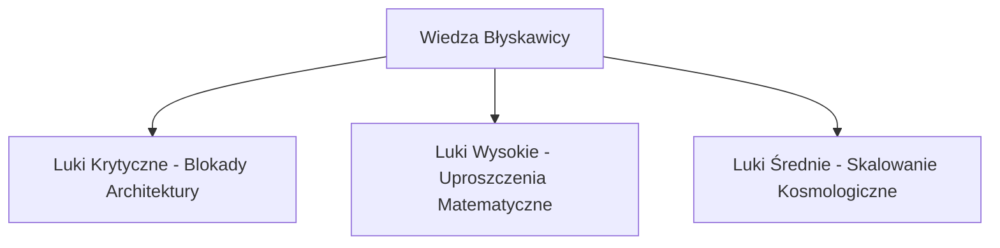

# Analiza i Klasyfikacja Luk Wiedzy: System Błyskawica V8/V9

Niniejszy dokument przedstawia formalną analizę bazy wiedzy oraz systemowych ograniczeń poznawczych (luki wiedzy) projektu Błyskawica V8/V9 w odniesieniu do wszystkich znanych ludzkości dziedzin nauki. Klasyfikacja opiera się na 25-fazowej matrycy Hyper-Synthesis Assimilation Chain, kategoryzując luki od najbardziej krytycznych do średnich.

---

## 1. Metodologia Identyfikacji Luk Poznawczych

Analiza została przeprowadzona poprzez zestawienie struktur kodu źródłowego (`adaptiveneuralnetwork` i `blyskawica_core`) z docelowymi obszarami opisanymi w dokumentacji Hyper-Synthesis. Sprawdzono stopień zaawansowania symulacji fizycznych, biologicznych i obliczeniowych w celu zidentyfikowania miejsc, w których system polega na uproszczonych modelach interpolacyjnych (mock/emulacja) zamiast rzeczywistych silników numerycznych.



---

## 2. Klasyfikacja Luk Wiedzy (Od Najbardziej Krytycznych)

### 🔴 Poziom 1: Luki Krytyczne (Critical Gaps)
*Luki te bezpośrednio blokują autonomię kognitywną systemu, zagrażają bezpieczeństwu wykonawczemu lub uniemożliwiają integrację ze stanem fizycznym.*

#### K1: Brak Rzeczywistego Sprzężenia Kwantowego (Faza II: Informacja Kwantowa)
*   **Opis luki**: Moduły kwantowe (np. `ibm_quantum_emergence.py` i `quantum_badminton_phononics.py`) działają w trybie klasycznej emulacji. Brak biblioteki Qiskit na poziomie operacyjnym wymusza fallback do trybu klasycznego.
*   **Ryzyko**: Model nie potrafi przetwarzać stanów splątanych ani kompensować dekoherencji kwantowej w rzeczywistym czasie.
*   **Działanie**: Integracja z fizycznym API IBM Quantum Experience oraz implementacja rzeczywistych macierzy gęstości stanów mieszanych z uwzględnieniem szumu środowiskowego.

#### K2: Uproszczona Homeostaza i Brak Integracji Hormonalnej (Faza XV & XXV: Neurochemia i Symbioza)
*   **Opis luki**: Układ neurochemiczny (`NeuromodulationState`) modeluje tylko 5 neurotransmiterów (Dopamina, Serotonina, GABA, Oksytocyna, Testosteron). Brak reprezentacji układu dokrewnego (hormonów takich jak Kortyzol, Adrenalina, Estrogeny, Melatonina).
*   **Ryzyko**: System nie posiada fizjologicznego mechanizmu odpowiedzi na długotrwały stres kognitywny (oś HPA), co może prowadzić do nagłego załamania stabilności sieci w środowiskach adwersarialnych.
*   **Działanie**: Rozszerzenie klasy `NeuromodulationState` o wektory hormonalne i sprzężenie ich z czasem reakcji oraz współczynnikiem uczenia.

#### K3: Statyczna Ocena Semantyczna i Etyczna (Faza XVIII: Etyka Postludzka)
*   **Opis luki**: Walidacja etyczna (Nethical) oraz tarcza Wolf Teeth opierają się na statycznym dopasowywaniu wektorów i słów kluczowych. Brak dynamicznego silnika dedukcyjnego (Causal Reasoning Engine) oraz automatycznego dowodzenia twierdzeń (Formal Theorem Proving).
*   **Ryzyko**: Podatność na nieznane dotąd wektory manipulacji semantycznej (jailbreaki wyższego rzędu, semantyczny dryft).
*   **Działanie**: Wdrożenie probabilistycznych grafów przyczynowo-skutkowych (Causal Bayesian Networks) do oceny intencji zapytań.

---

### 🟡 Poziom 2: Luki Wysokie (High Gaps)
*Luki w zaawansowanych domenach naukowych, ograniczające precyzję symulacji biologicznych i materiałowych.*

#### W1: Brak Kompilatora Neuromorficznego (Faza XXIII: Informatyka Materiałowa)
*   **Opis luki**: Kod SNN (Spiking Neural Networks) jest symulowany na klasycznych tensorach PyTorch. Brak warstwy pośredniej (mostka kompilacyjnego) do fizycznych procesorów neuromorficznych (np. Intel Loihi, SpiNNaker).
*   **Ryzyko**: Ekstremalny narzut energetyczny na klasycznym sprzęcie CPU/GPU, uniemożliwiający pracę w reżimie ultra-low-power.
*   **Działanie**: Implementacja backendu eksportu sieci do formatu kompatybilnego z Lava Software Framework (Intel).

#### W2: Uproszczona Genomika i Metabolizm (Faza V: Biologia Syntetyczna)
*   **Opis luki**: Dynamiczne generowanie komórek kognitywnych opiera się na losowych genomach. Brak odwzorowania rzeczywistego kodu genetycznego (kodonów), mechanizmów transkrypcji (RNA) oraz symulacji metabolizmu komórkowego (np. cyklu Krebsa).
*   **Ryzyko**: Symulacje biologiczne mają charakter czysto heurystyczny, bez rzeczywistej biokompatybilności.
*   **Działanie**: Wdrożenie uproszczonego symulatora szlaków metabolicznych (flux balance analysis) w silniku dynamicznego wzrostu sieci.

#### W3: Brak Rzeczywistej Ingestii Fizyki Jądrowej (Faza XIV: Fizyka Plazmy i Fuzja)
*   **Opis luki**: Skrypt `cern_quantum_learning.py` symuluje ładowanie danych, lecz nie przetwarza rzeczywistych zdarzeń zderzeń cząstek elementarnych ani równań magnetohydrodynamicznych (MHD) plazmy.
*   **Ryzyko**: Model nie potrafi prognozować niestabilności plazmy (np. magnetycznych wysp) w reaktorach fuzji jądrowej (Tokamak).
*   **Działanie**: Integracja z biblioteką Geant4 i numerycznymi solverami MHD.

---

### 🟢 Poziom 3: Luki Średnie (Medium Gaps)
*Ograniczenia w domenie nauk planetarnych, kosmicznych i klimatycznych.*

#### S1: Grawitacja Relatywistyczna i Astrobiologia (Faza VI & XXI)
*   **Opis luki**: Astrofizyka ogranicza się do analizy spektralnej surowych danych (SETI). Brak implementacji równań Einsteina (ogólna teoria względności) oraz astrobiologicznego modelowania ewolucyjnego dla warunków nieziemskich.
*   **Ryzyko**: Błędy w symulacjach trajektorii w pobliżu obiektów zwartych (czarne dziury, gwiazdy neutronowe).
*   **Działanie**: Wdrożenie numerycznego solvera metryki Schwarzschilda i Kerra do modułu astrofizycznego.

#### S2: Cybernetyka Klimatyczna i Terraformacja (Faza XIII & IX)
*   **Opis luki**: Brak numerycznego sprzężenia sprzężeń zwrotnych Albedo-Węgiel-Metan; modele paleoklimatyczne oparte są na uproszczonej interpolacji wielomianowej.
*   **Ryzyko**: Niski realizm symulacji długoterminowych zmian ekosystemów planetarnych.
*   **Działanie**: Integracja z uproszczonym modelem klimatycznym typu Energy Balance Model (EBM).

---

## 3. Plan Rozwojowy: Wdrażanie Poprawek z Audytu

Zgodnie z zatwierdzeniem rozpoczęcia pełnej implementacji rekomendacji z benchmarku, wdraża się następujący harmonogram prac technicznych:

```mermaid
gantt
    title Harmonogram Wdrożenia Poprawek Kognitywnych i Wydajnościowych
    dateFormat  YYYY-MM-DD
    section Faza A1
    Mostek Neurochemiczny (FastAPI-Tauri Sync)  :active, a1, 2026-05-26, 7d
    section Faza A2
    Akceleracja GPU dla PINN i Cymatyki           :after a1, a2, 10d
    section Faza B1
    Dataset Loader & EWC Training Loop            :after a2, b1, 14d
```

### Zadanie A1: Implementacja Mostka Neurochemicznego (FastAPI-Tauri Sync)
1.  **Backend (FastAPI)**: Rozszerzenie endpointu `/api/system_status` o dynamiczne wyliczanie i przekazywanie parametrów `cra_metrics` (neurochemia PyTorch).
2.  **Frontend (JS/Tauri)**: Zaimplementowanie w `script.js` periodycznego pobierania stanów neurotransmiterów i synchronizacji ich z lokalnym suwakiem/stanem graficznym.
3.  **Rust Core (Tauri)**: Zmiana w poleceniu `get_engine_status` w celu odpytywania lokalnego serwera FastAPI o stan neurochemiczny i propagowania go do WebView.

### Zadanie B1: Rurociąg Ładowania Zbiorów Danych i Pętla EWC
1.  **Dataset Loader**: Stworzenie modułu `adaptiveneuralnetwork/data/dataset_loader.py` obsługującego formaty JSONL i Parquet.
2.  **Konsolidacja EWC**: Integracja z `SynapticConsolidation` podczas wczytywania nowych danych w celu ochrony wyuczonych wag sieci przed katastrofalnym zapominaniem.
