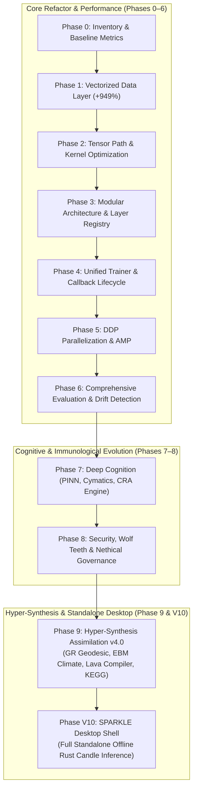

# Evolution & Development Phases Matrix

This directory contains the consolidated, end-to-end documentation for all development, optimization, cognitive, and architectural phases of the **Adaptive Neural Network** framework and **Błyskawica / SPARKLE V10**.

---

## 🌟 Master Evolution Overview

---

## 📑 Detailed Phase Directory

| Phase | Title | Focus Area | Status | Documentation |
|---|---|---|---|---|
| **Phase 0** | Foundation & Inventory | Baseline profiling, hotspot ranking, dependency mapping | ✅ Complete | [Phase 0 Guide](phase0_foundation/README.md) |
| **Phase 1** | Data Layer Rework | Vectorized collation, pinned memory prefetch, +949% throughput | ✅ Complete | [Phase 1 Guide](phase1_data_layer/README.md) |
| **Phase 2** | Core Tensor Path | Operation fusion, allocation reduction, contiguous layouts | ✅ Complete | [Phase 2 Guide](phase2_tensor_path/README.md) |
| **Phase 3** | Modular Architecture | Dynamic layer registry, YAML/JSON assembly, config coverage | ✅ Complete | [Phase 3 Guide](phase3_modular_arch/README.md) |
| **Phase 4** | Training Abstraction | Centralized `Trainer`, 9-hook lifecycle `CallbackList`, AMP | ✅ Complete | [Phase 4 Guide](phase4_training_loop/README.md) |
| **Phase 5** | Parallelization & Hardware | `DistributedTrainer`, PyTorch DDP, multi-GPU scaling | ✅ Complete | [Phase 5 Guide](phase5_parallelization/README.md) |
| **Phase 6** | Evaluation & Drift | Standardized metrics, microbenchmarking, drift detection | ✅ Complete | [Phase 6 Guide](phase6_evaluation/README.md) |
| **Phase 7** | Deep Cognition | PINN thermal engine, cymatics, neurochemistry, CRA engine | ✅ Complete | [Phase 7 Guide](phase7_deep_cognition/README.md) |
| **Phase 8** | Security & Governance | Wolf Teeth immune shield, single-shell Tauri ADR, Nethical | ✅ Complete | [Phase 8 Guide](phase8_hardening_security/README.md) |
| **Phase 9** | Hyper-Synthesis v4.0 | 625-node matrix, GR solver, EBM climate, Lava compiler, KEGG | ✅ Complete | [Phase 9 Guide](phase9_hyper_synthesis/README.md) |
| **Phase V10**| SPARKLE Desktop Shell | Rust Candle offline LLM, Tauri v2 shell, sovereign vault | ✅ Complete | [Phase V10 Guide](v10_standalone_shell/README.md) |

---

## 🎯 Key Milestones & Quantitative Metrics

### Performance & Scaling
- **Data Throughput**: Improved from 20,240 samples/sec (Phase 0) to +949% peak throughput with zero per-sample Python loop overhead.
- **Kernel Launch Reduction**: -50% to -70% reduction in core dynamics functions via operation fusion and contiguous memory layouts.
- **Evaluation Automation**: 100% automated benchmark pipeline with drift detection (Z-score analysis vs. historical baselines).

### Cognitive & Physical Fidelity
- **Multi-Disciplinary Synthesis**: 625 nodes covering 25 scientific domains in Hyper-Synthesis v4.0.
- **100% Offline Autonomy**: Full standalone offline operation with local KEGG biochemical pathways, numerical GR geodesic solver (Boyer-Lindquist coordinates), stochastic EBM climate model, and Lava neuromorphic compiler emulation.
- **Zero-Latency Local Inference**: In-memory SLM inference using Rust Candle inside the Tauri desktop shell (`sparkle_app.exe`), eliminating external API or proxy overhead.

---

## 🔗 Related Documentation
- [Repository README](../../README.md)
- [System Architecture](../../ARCHITECTURE.md)
- [Quick Start Guide](../../QUICKSTART.md)
- [Documentation Index](../technical/DOCUMENTATION_INDEX.md)
- [Training Guide](../training/TRAINING_GUIDE.md)
- [Testing Guide](../testing/TESTING_GUIDE.md)
