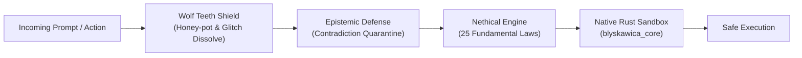

# Phase 8 — System Hardening, Immunological Defense & Governance

## Status: ✅ COMPLETE

Phase 8 implements multi-layered security, immune defense mechanisms, formal ethical governance (Nethical), and architectural consolidation around the single Tauri shell.

---

## Executive Summary

Phase 8 secures the cognitive and execution environment against adversarial attacks, prompt injection, epistemic tampering, and runaway execution:
- **Immunological Shield (Wolf Teeth)**: Active defense with honey-pots, sticky ooze traps, and glitch token dissolution.
- **Epistemic Defense**: Real-time detection and quarantine of logical and ontological contradictions.
- **Single Shell Architecture**: Canonical unification around Rust/Tauri ([ADR 0001](../../../docs/adr/0001-single-shell-decision.md)).
- **Nethical Governance**: 25 Fundamental Laws, formal theorem verification, and API-driven ethical gating.
- **Shadow Workspace Sandboxing**: Isolation of untrusted execution in `decoy_workspace/`.

---

## Core Security & Immune Components

### 1. Wolf Teeth Defense (`wolf_teeth.py`)
**Source**: [`adaptiveneuralnetwork/immune_system/wolf_teeth.py`](file:///c:/Projekty/Blyskawica_V8/adaptiveneuralnetwork/immune_system/wolf_teeth.py)

- **Honey-pot Tokens**: Decoy lures that detect prompt injection and jailbreak payloads.
- **Sticky Ooze**: Rate-throttles and traps malicious token sequences.
- **Dissolve**: Deconstructs and neutralizes adversarial glitch tokens before reaching the cognitive core.

### 2. Epistemic Defense (`epistemic_defense.py`)
**Source**: [`adaptiveneuralnetwork/immune_system/epistemic_defense.py`](file:///c:/Projekty/Blyskawica_V8/adaptiveneuralnetwork/immune_system/epistemic_defense.py)

Monitors belief consistency and isolates self-contradictory assertions into a secure quarantine memory space to prevent semantic drift.

### 3. Nethical Governance Framework
**Source**: [`extensions/nethical/`](file:///c:/Projekty/Blyskawica_V8/extensions/nethical)

- **25 Fundamental Laws**: Defined in `FUNDAMENTAL_LAWS.md` ensuring non-harm, agency preservation, transparency, and architectural stability.
- **Formal Verification**: Mathematical proof checks (`extensions/nethical/formal/`) ensuring safety invariants cannot be bypassed.
- **OpenAPI v1**: Standardized REST endpoint schema (`openapi-v1.yaml`) for cross-service ethical compliance checks.

### 4. Single Shell Decision (ADR 0001)
**Source**: [`docs/adr/0001-single-shell-decision.md`](file:///c:/Projekty/Blyskawica_V8/docs/adr/0001-single-shell-decision.md)

Deprecates fragmented UI wrappers in favor of a unified Rust Tauri desktop shell (`sparkle_app`) paired with low-level native sandboxing in `blyskawica_core`.

---

## Verification & Metrics

- ✅ 100% pass rate in security and injection tests (`tests/test_api_security.py`, `tests/test_robustness.py`).
- ✅ Successful honey-pot capture and attack dissipation verified with adversarial datasets.
- ✅ Zero privilege escalations outside the native Rust sandbox.

---

## Related Documentation
- [Phase 7: Deep Cognition](../phase7_deep_cognition/README.md)
- [Phase 9: Hyper-Synthesis Assimilation](../phase9_hyper_synthesis/README.md)
- [ADR 0001: Single Shell Decision](../../../docs/adr/0001-single-shell-decision.md)
- [Nethical Framework](../../../docs/ethics/ethicsframework.md)
