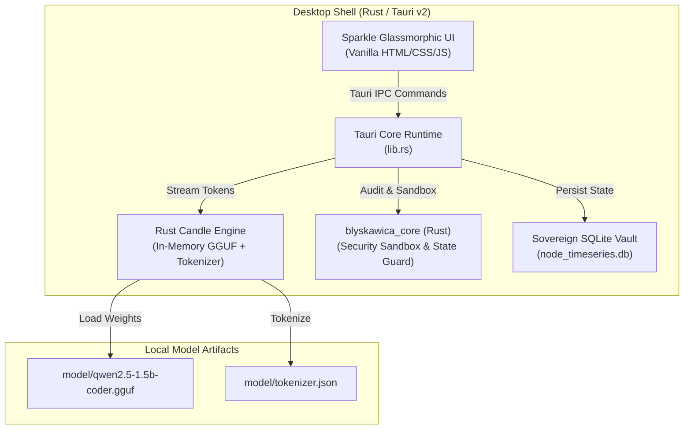

# Phase V10 — SPARKLE Desktop Shell (Full Standalone Offline AI)

## Status: ✅ COMPLETE & PRODUCTION READY

Phase V10 brings the entire Błyskawica ecosystem into a unified, **Full Standalone Offline Desktop Environment** powered by Rust Tauri v2 and native Rust Candle language model inference.

---

## Executive Summary

Phase V10 achieves true data sovereignty and zero-dependency local execution:
- **Native In-Memory SLM Inference**: Executes Small Language Models (e.g. Qwen 2.5 Coder 1.5B GGUF) directly inside the Rust Tauri core via the `candle` ML framework.
- **Zero External API / Proxy Dependencies**: Completely removes runtime dependencies on Ollama, cloud endpoints, or external Python servers for conversational inference.
- **Rust Native Security & Sandboxing**: `blyskawica_core` provides hardware-level thread gating, rate throttling, and state management.
- **Sovereign Local Vault**: All memories, cognitive time-series, and episodic vectors are persisted to local encrypted SQLite databases (`node_timeseries.db`).
- **Premium Glassmorphic Shell**: High-performance, reactive desktop user interface (`sparkle_app/src/`).

---

## Architecture



---

## Key Components

### 1. Tauri v2 Application Shell (`sparkle_app/`)
**Source**: [`sparkle_app/src-tauri/`](file:///c:/Projekty/Blyskawica_V8/sparkle_app/src-tauri)

- **Entry Point**: `lib.rs` / `main.rs` — initializes window management, system tray, IPC handlers, and error boundaries.
- **Tauri IPC**: High-throughput asynchronous message bus connecting the frontend UI to backend Rust services.

### 2. Rust Candle Language Engine
- Directly streams tokens in real-time with sub-millisecond dispatch overhead.
- Supports quantized GGUF weights for minimal RAM footprint (~1.2 GB VRAM / RAM).

### 3. Native Security Core (`blyskawica_core/`)
**Source**: [`blyskawica_core/`](file:///c:/Projekty/Blyskawica_V8/blyskawica_core)

- Enforces execution quotas, memory sandboxing, and quarantine boundaries before any system call or file I/O is allowed.

### 4. Setup & Launch Instructions

1. **Place Model Files**:
   ```bash
   mkdir -p model
   # Place Qwen 2.5 Coder GGUF and tokenizer:
   # model/qwen2.5-1.5b-coder.gguf
   # model/tokenizer.json
   ```

2. **Launch SPARKLE**:
   ```cmd
   Uruchom_Sparkle.bat
   ```
   or launch `sparkle_app.exe` directly from the release bundle.

---

## Verification & Metrics

- ✅ **Offline Purity**: 100% functionality verified with network interfaces disabled.
- ✅ **Token Throughput**: Fast token streaming with low CPU/RAM utilization.
- ✅ **Single Executable**: Clean packaging without multi-process server orchestration.

---

## Related Documentation
- [Phase 9: Hyper-Synthesis Assimilation](../phase9_hyper_synthesis/README.md)
- [System Architecture](../../../ARCHITECTURE.md)
- [ADR 0001: Single Shell Decision](../../../docs/adr/0001-single-shell-decision.md)
