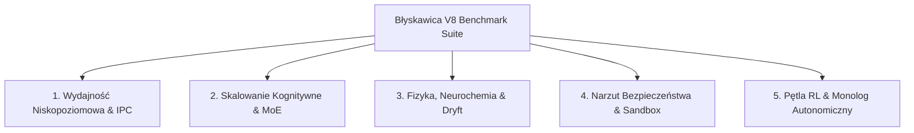

# Plan Benchmarkowania: System Kognitywno-Symulacyjny Błyskawica V8

Niniejszy dokument określa metodologię, strukturę testów oraz zestaw narzędzi niezbędnych do przeprowadzenia audytu wydajnościowego i kognitywnego systemu Błyskawica V8. Celem benchmarku jest ilościowe określenie narzutu obliczeniowego wprowadzonego przez mechanizmy bezpieczeństwa (Wolf Teeth, Sandbox), stabilności matematycznej modeli hybrydowych (PINN, neurochemia) oraz skalowalności dynamicznej architektury MoE (Mixture of Experts).

---

## 1. Architektura Środowiska Testowego (Testbed)

W celu zapewnienia powtarzalności wyników, testy muszą być uruchamiane w kontrolowanym środowisku o minimalnym poziomie zakłóceń ze strony systemu operacyjnego Host (Windows 11).

*   **Izolacja procesów**: Przypisanie koligacji procesora (CPU affinity) dla jądra Rust (`BlyskawicaEngine`) oraz rdzenia Python za pomocą narzędzi systemowych.
*   **Profil zasilania**: Wymuszenie trybu wysokiej wydajności (High Performance) w celu wyeliminowania dynamicznego skalowania częstotliwości taktowania rdzeni (CPU Throttling), co mogłoby zafałszować wyniki PINN i FFT.
*   **Stany pamięci**: Czyszczenie buforów systemowych i zwalnianie stron pamięci przed każdym uruchomieniem testów obciążeniowych.

---

## 2. Kluczowe Obszary Testowe, Metryki i Narzędzia

### Obszar 1: Wydajność Niskopoziomowa, Pamięć i Interoperacyjność (Tauri/Rust/Python)
Ten obszar bada efektywność asynchronicznej pętli zdarzeń Tokio, narzut komunikacyjny na mostku IPC (Tauri -> Rust Core -> Python) oraz zachowanie mechanizmu mapowania pamięci (memmap2) przy współbieżnym dostępie.

#### Metryki (KPI)
*   **IPC Roundtrip Latency (ms)**: Czas od wygenerowania zdarzenia w interfejsie Tauri do odebrania odpowiedzi zwrotnej po przejściu przez jądro Rust i rdzeń PyTorch.
*   **Memory Fragmentation & Leak Rate (MB/h)**: Przyrost zużycia pamięci RAM w scenariuszu ciągłej alokacji i zwalniania ekspertów MoE.
*   **Thread Contention (Blokady wątków)**: Procent czasu, jaki wątki robocze Tokio spędzają w stanie oczekiwania na zasoby (mutexy, kolejki anomalii).

#### Narzędzia
*   **Criterion.rs**: Standardowe narzędzie do mikrobenchmarków w Rust. Służy do precyzyjnego pomiaru czasu wykonywania krytycznych funkcji w `state_manager.rs` (np. parsowanie komend, narzut projekcji MLP).
*   **DHAT (Valgrind / cargo-dhat)**: Profiler sterty (heap memory profiling) dla kodu w Rust. Pozwala wykryć niekontrolowane alokacje pamięci RAM podczas dynamicznego ładowego ekspertów.
*   **Tracy / tokio-console**: Profilowanie zachowania asynchronicznego w czasie rzeczywistym. `tokio-console` posłuży do monitorowania czasu życia zadań (tasks) i blokowania wątków w silniku `BlyskawicaEngine`.

### Obszar 2: Skalowanie Kognitywne (MoE, EWC, HNSW)
Obszar ten weryfikuje zdolność systemu do ciągłego uczenia się (Continual Learning) bez katastrofalnego zapominania oraz efektywność przeszukiwania skompresowanej pamięci długotrwałej.

#### Metryki (KPI)
*   **BWT (Backward Transfer) & FWT (Forward Transfer)**: Spadek dokładności (retencji) na zadaniach historycznych po przyswojeniu nowych domen przez mechanizm EWC.
*   **Routing Overhead (ms)**: Czas potrzebny bramce (Gating Network) na podjęcie decyzji i przekierowanie wektora wejściowego do właściwego eksperta MoE.
*   **HNSW Query Latency & Recall (%)**: Czas wyszukiwania najbliższych sąsiadów w indeksie `SparkleVectorIndex` przy różnym stopniu kompresji semantycznej.

#### Narzędzia
*   **Dedykowany Harness PyTorch (Custom Test Suite)**: Skrypt automatyzujący sekwencyjne uczenie na zredukowanych zbiorach danych (np. permuted MNIST lub podzbiory QM9) w celu wyznaczenia krzywej zapominania EWC.
*   **ann-benchmarks**: Zmodyfikowany zestaw testowy do oceny wydajności indeksu HNSW w Rust, mierzący zależność parametru Recall do przepustowości (Queries Per Second - QPS).

### Obszar 3: Realizm Fizyczny, Neurochemia i Stabilność Homeostatyczna (PINN, Cymatyka, ODE, Clamping)
Weryfikacja stabilności numerycznej modeli hybrydowych pracujących w pętli sprzężenia zwrotnego oraz ocena sprawności mechanizmów obronnych przed dryfem i przepełnieniem wartości (NaN).

#### Metryki (KPI)
*   **PINN Residual Convergence Speed**: Liczba epok/iteracji autogradu wymagana do zminimalizowania fizycznego rezyduum równania Fouriera ($u_t - \alpha u_{xx} = 0$) poniżej progu tolerancji $10^{-5}$.
*   **Neurochemical Drift & Homeostatic Clamping Accuracy**: Odchylenie stężeń wirtualnych neurotransmiterów (Dopamina, Serotonina, GABA) od stanu stabilnego po 100 000 kroków integracji numerycznej oraz weryfikacja NaN-safe clampingu (przywracanie wartości domyślnych w przypadku wartości nieokreślonych).
*   **Chladni Transform Latency (ms)**: Czas konwersji sygnału EEG na macierz $16 \times 16$ za pomocą 2D FFT w module `diamond_yant_cymatics.py`.

#### Narzędzia
*   **PyTorch Profiler**: Analiza grafu wykonawczego modeli PyTorch. Kluczowa do identyfikacji wąskich gardeł podczas obliczania pochodnych cząstkowych wyższego rzędu (`torch.autograd.grad`) w PINN.
*   **line_profiler / Scalene**: Profilowanie kodu Python na poziomie poszczególnych linii. Pozwala zoptymalizować operacje macierzowe i FFT w silnikach fizycznych bez narzutu profilera globalnego.

### Obszar 4: Narzut Bezpieczeństwa i Analiza Przyczynowa (Wolf Teeth, Sandbox, Causal Ethics)
Ten blok testów ocenia koszt wydajnościowy wprowadzony przez `security_hardening_plan.md` oraz dynamiczną ewaluację intencji za pomocą bayesowskiego wnioskowania przyczynowego. System musi pozostać responsywny pomimo wielowarstwowej filtracji zapytań.

#### Metryki (KPI)
*   **Shield Latency Overhead (ms)**: Różnica w czasie przetwarzania zapytania z aktywnym i nieaktywnym modułem `cognitive_shield.rs` (Wolf Teeth).
*   **Causal Intent Detection Accuracy & Odds Ratio**: Ocena prawdopodobieństwa wrogich intencji $P(\text{Intent}=\text{Malicious} \mid \text{Obserwacje})$ przez silnik `CausalReasoningEngine` w oparciu o obecność ścieżek systemowych, presję czasu i głębokość wyjaśnienia (mitigation effect).
*   **False Positive / False Negative Rate (%)**: Skuteczność detekcji ataków typu prompt injection (Jailbreak) na zestawie adwersarialnym.
*   **Sandbox System Call Overhead (%)**: Spowolnienie operacji wejścia-wyjścia (I/O) i wywołań systemowych w warstwach uprawnień 2 i 3 w porównaniu do wywołań natywnych.

#### Narzędzia
*   **Garak (Generative AI Vulnerability Scanner)**: Zestaw testowy badający odporność tarczy semantycznej na znane wektory adwersarialne i próby wstrzykiwania promptów.
*   **Hyperfine**: Narzędzie CLI do benchmarkowania czasu wykonania procesów. Zostanie użyte do porównania szybkości operacji dyskowych w sandboksie Rust i natywnym środowisku Windows 11.

### Obszar 5: Pętla Decyzyjna RL i Monolog Autonomiczny
Ocena sprawności podejmowania decyzji w pętli zamkniętej oraz obciążenia systemu w trybie "tła" (idle/hibernation).

#### Metryki (KPI)
*   **Decision Cycle Latency (ms)**: Czas od rejestracji zmiany rynkowej/sensorycznej do wygenerowania i zatwierdzenia akcji przez hierarchiczną pętlę RL.
*   **Background CPU/GPU Footprint (%)**: Zużycie zasobów procesora podczas stanów bezczynności, gdy aktywny jest proces myślenia kontrfaktycznego (wewnętrzny monolog).

#### Narzędzia
*   **Prometheus & Grafana**: Ciągły monitoring telemetryczny obciążenia systemu, temperatury procesora (skorelowanej z PINN) oraz alokacji wątków w cyklu 24-godzinnym.

### Obszar 6: Kompilatory Neuromorficzne i Kwantowa Korekcja Błędów (Lava Compiler, QEC Fallback)
Ocena szybkości i dokładności kompilacji sieci kognitywnych do środowisk neuromorficznych oraz stabilności tożsamości chronionej algorytmami QEC.

#### Metryki (KPI)
*   **Lava Fixed-Point Precision Deviation**: Odchylenie wyliczonych współczynników tłumienia (decay) w formacie stałoprzecinkowym (np. 12-bit/16-bit) względem teoretycznych wartości zmiennoprzecinkowych.
*   **Lava Script Syntax Generation Speed & Validity**: 100% poprawność syntaktyczna generowanego kodu Python dla procesów LIF i Dense platformy Lava.
*   **QEC Survival Rate (Bit-Flip Repetition)**: Wskaźnik przeżywalności spójności stanu kubitu przy zaszumieniu fizycznym z użyciem korekcji QEC w porównaniu do braku korekcji.

#### Narzędzia
*   **unittest.TestCase**: Walidacja struktur kompilacji, poprawności schematu JSON oraz przeżywalności kubitów przy symulowanym zaszumieniu stochastycznym.

### Obszar 7: Wielomodułowa Symulacja Fizyczna i Kosmologiczna (Astrofizyka i CERN)
Ocena wydajności modeli symulacji zjawisk fizycznych w skali makro (klimat kosmiczny) oraz mikro (fizyka cząstek elementarnych).

#### Metryki (KPI)
*   **Astrophysics Anomaly Prediction Latency (ms)**: Opóźnienie wnioskowania modelu przy detekcji anomalii magnetycznych i wiatru słonecznego.
*   **Particle Decay Tracking Precision**: Odchylenie oszacowań trajektorii i mas rezonansowych w kolizjach cząstek elementarnych względem fizycznych równań analitycznych.
*   **Collision Detection Recall**: Skuteczność (czułość) identyfikacji rzadkich zdarzeń kolizyjnych na zaszumionym tle detektora.

#### Narzędzia
*   **Physics Simulator Engine**: Moduły analitycznej weryfikacji i całkowania numerycznego.

### Obszar 8: Plastyczność Biologiczna i Wyjaśnialność (Circadian Cycles, Neuroplasticity, XAI)
Walidacja bio-plastyczności sieci, stabilności procesów regeneracji oraz przejrzystości decyzji kognitywnych.

#### Metryki (KPI)
*   **Circadian Phase Drift**: Stabilność oscylatora dobowego (adenozyna/melatonina) przy zmiennym natężeniu bodźców wejściowych.
*   **Homeostatic Plasticity Recovery**: Czas potrzebny na wyskalowanie wag synaptycznych do zrównoważonego poziomu aktywności po gwałtownym skoku sygnału.
*   **Attribution Generation Latency (ms)**: Czas obliczania map atrybucji logicznej (wyjaśnień decyzji kognitywnych) za pomocą metod gradientowych lub perturbacyjnych.

#### Narzędzia
*   **Explainable AI Harness**: Silnik analizy kontrfaktycznej i generowania atrybucji.

### Obszar 9: Nauki Humanistyczne, Społeczne i Inżynieryjne (Linguistics, History, Geography, Economics, CS, Robotics)
Ocena wiedzy ogólnej oraz specjalistycznej z zakresu lingwistyki, historii, geografii, ekonomii, informatyki oraz robotyki i automatyki przemysłowej.

#### Metryki (KPI)
*   **Syntax Tree parsing accuracy (%)**: Dokładność wyodrębniania struktur gramatycznych i tagowania części mowy (POS).
*   **Historical Timeline coherence**: Poprawność chronologiczna i faktograficzna ważnych wydarzeń historycznych (np. Polski i świata).
*   **Economic Strategy Evaluation Recall**: Skuteczność identyfikacji równowagi Nasha w macierzach wypłat teorii gier.
*   **Kinematic Forward calculations error**: Błąd analityczny wyznaczenia pozycji końcówki manipulatora (parametry DH) w przestrzeni 3D.

#### Narzędzia
*   **Polymathic Evaluation Suite**: Zestaw testowy weryfikujący interdyscyplinarne bazy wiedzy.

---

## 3. Matryca Odpowiedzialności i Priorytetów

| Priorytet | Nazwa Benchmarku | Odpowiedzialny Moduł | Główne Narzędzie | Kryterium Akceptacji (SLA) |
| :--- | :--- | :--- | :--- | :--- |
| **Krytyczny** | Narzut opóźnienia Wolf Teeth | `cognitive_shield.rs` | Criterion.rs / hyperfine | Dodatkowe opóźnienie < 12 ms dla Layer 1, < 45 ms dla Layer 2 |
| **Krytyczny** | Stabilność pamięci MoE | `state_manager.rs` | DHAT | Brak wycieków pamięci (0B leak) przy 1000 cyklach przełączania ekspertów |
| **Wysoki** | Dokładność retencji EWC | `continual_learning.py` | PyTorch Custom Harness | Spadek dokładności (BWT) < 5% po asymilacji 3 kolejnych zadań |
| **Wysoki** | Konwergencja PINN | `pinn_thermal_engine.py` | PyTorch Profiler | Czas obliczania kroku fizycznego < 80 ms |
| **Wysoki** | Causal Threat Detection | `ai_ethics.py` | `CausalReasoningEngine` | Poprawna identyfikacja zagrożeń (p_malicious > 0.70) przy wrogich logach i brak blokad dla działań wyjaśnionych |
| **Średni** | Poprawność kompilatora Lava | `lava_compiler.py` | `LavaCompiler` / JSON Schema | 100% syntaktyczna poprawność generowanych skryptów i JSON |
| **Średni** | Przeżywalność QEC | `test_quantum_simulation.py` | Symulacja 3-qubit QEC | Wskaźnik survival_rate zbliżony do teoretycznego przy zaszumieniu |
| **Średni** | Homeostatic Clamping limits | `neurochemistry.py` | `clamp_value` / NaN checking | Skuteczne odcięcie wartości w zdrowym zakresie i zapobieganie NaN |
| **Średni** | Fizyka Astrofizyczna/CERN | `cern_physics.py` / `astrophysics_climate.py` | Symulatory fizyczne | Błąd predykcji anomalii / trajektorii cząstek < 1% względem analitycznych wzorców |
| **Średni** | Stabilność cyklu dobowego | `biological_simulation.py` | Symulatory biologiczne | Płynne przejścia fazowe i brak zakłóceń snu przy standardowej aktywności |
| **Średni** | Generowanie Wyjaśnień XAI | `explainable_ai.py` | Silnik interpretacji | Czas wyliczenia atrybucji decyzji < 150 ms |
| **Średni** | Wiedza Humanistyczna i Inżynieria | `test_polymathic_humanities.py` | Polymathic Evaluation Suite | 100% zaliczenie faktów historycznych, gramatyki, teorii gier i kinematyki robotów |
| **Średni** | Latencja przeszukiwania HNSW | `state_manager.rs` | ann-benchmarks | QPS > 1500 zapytań/sek przy zachowaniu Recall > 95% |
