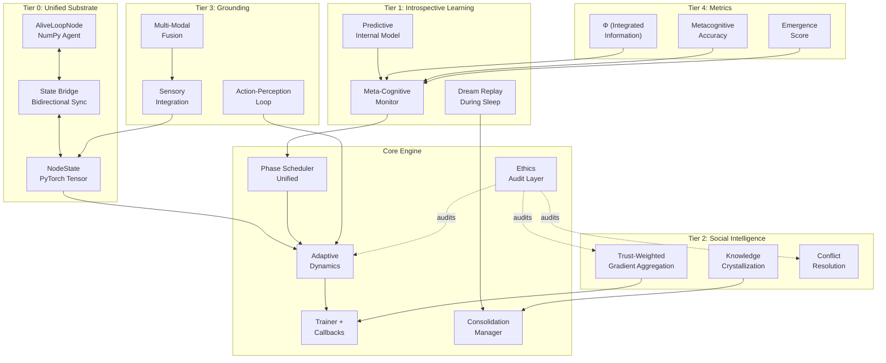
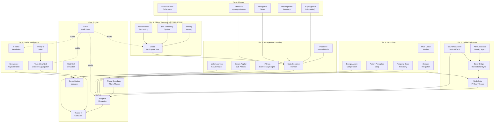

# Roadmap Conscious — Toward High-End Adaptive AI

> *"The measure of intelligence is the ability to change."* — Albert Einstein

_Last updated: 2026-04-10 (Rev 2 — integrated development priorities)_

---

## Preface — My Assessment of Where We Stand

After a thorough examination of this repository, I want to be candid about what we have and what we still need.

**What is genuinely impressive:**
- The biologically-inspired phase system (ACTIVE → SLEEP → INTERACTIVE → INSPIRED) is a novel abstraction. Few frameworks treat neural computation as a living process with circadian rhythm, anxiety, rest, and creative bursts. This is not cosmetic — it creates a fundamentally different optimization landscape.
- The `AliveLoopNode` (3,000+ lines) is an ambitious agent: emotions, trust networks, circuit breakers, dead letter queues, social signals, deduplication, ethical audit. It models a *sentient participant* in a network, not just a tensor-shuffling unit.
- Six production-grade refactor phases are complete with real metrics (+949% throughput in the data layer alone). The `Trainer`, callbacks, DDP, AMP — solid engineering.
- The ethical framework with 25 laws and mandatory audit is philosophically coherent and technically enforced at the node level.

**What we need to confront honestly:**
- The biologically-inspired `core/` (AliveLoopNode, network.py, evolutionary engine) and the PyTorch ML pipeline (`adaptiveneuralnetwork/`) are **two semi-separate systems**. They share a name and an ethical layer, but the AliveLoopNode doesn't plug into the Trainer or the vectorized tensor path. This is the single biggest architectural gap.
- There is a lot of code surface area — neuromorphic backends (Loihi2, SpiNNaker2), sensory processing, IoT edge, multimodal V+L, curriculum learning, few-shot, continual, self-supervised — but many of these are isolated modules. They don't compose into an end-to-end pipeline where one could say "train an adaptive network that uses Hebbian consolidation, stochastic phase transitions, and few-shot memory on a real-world task and show the emergent behavior."
- Phase 7 ("machine deep learning process") is still TBD and this is where the real confrontation with intelligence happens.

> [!IMPORTANT]
> This roadmap is not about accumulating more features. It is about **depth** — making what we have interoperate, producing measurable intelligence metrics, and building something that can surprise us.

---

## Part I — The Consciousness Stack

What follows is a layered architecture for conscious AI development. Each tier builds on the one below it.

### Tier 0: Unified Substrate (Foundation Merge)

**Goal:** Make the biological simulation and the ML pipeline into ONE coherent system.

| Task | Description | Priority |
|------|-------------|----------|
| **Bridge `AliveLoopNode` ↔ `NodeState`** | Create an adapter that translates between the numpy-based AliveLoopNode state (energy, anxiety, trust, phase, position) and the vectorized PyTorch `NodeState` tensors used by `AdaptiveDynamics`. This enables the biological simulation to drive the actual training dynamics. | 🔴 Critical |
| **Unified Phase Regime** | The `PhaseScheduler` in `adaptiveneuralnetwork/core/phases.py` and the phase logic in `AliveLoopNode.step_phase()` must converge. One phase system. One source of truth. The scheduler should support both vectorized (batch training) and agent-based (simulation) modes. | 🔴 Critical |
| **Event-Driven Architecture** | Replace the current tick-based simulation with an event-driven architecture. Nodes should emit events (phase_changed, anxiety_spike, memory_consolidated, trust_updated) that the training loop can subscribe to. This is how biological signals modulate learning. | 🟡 High |
| **Emotional State Tensor** | Formalize the emotional state (anxiety, joy, grief, hope, curiosity, frustration, resilience, calm) as a proper PyTorch tensor that flows through the computational graph. Currently these are float attributes on the AliveLoopNode — they need to be differentiable. | 🟡 High |
| **Neuromodulation System** | ⚡ *From Advice.* Implement dopamine, serotonin, acetylcholine-like modulatory signals as first-class entities. Built real neuromodulatory loop: dopamine → reward prediction error. | ✅ Done |
| **Glial Cell Simulation** | ⚡ *From Advice.* Add non-neuronal support cells that monitor and optimize the network: energy redistribution (astrocyte-like), waste clearance during SLEEP (microglia-like), myelination of frequently-used pathways (oligodendrocyte-like). **STATUS:** Does not exist. This is net-new but would integrate naturally with the energy management system in `AliveLoopNode`. | 🟢 Medium |

**My Thinking:** The deepest mistake in AI architecture is separating the "brain" (tensor math) from the "body" (simulation, environment, emotional state). Consciousness research strongly suggests these are ONE system. The AliveLoopNode has an emotional body; the AdaptiveDynamics has a computational brain. They must merge. This is not a refactor — it is the single most consequential architectural decision on this roadmap.

**Notes on Advice — Neuromodulation:** The user's suggestion to add dopamine/serotonin-like signals is exactly right. I found that `neuromorphic.py` already declares `DOPAMINE_MODULATED` as a plasticity type and `modulator_type` as a config field — but it's scaffolding only. The real implementation would map dopamine → TD error (temporal difference), serotonin → discount factor / patience, norepinephrine → global gain / alertness. These map beautifully onto the existing emotional states: joy ≈ dopamine, calm ≈ serotonin, anxiety ≈ norepinephrine.

---

### Tier 1: Introspective Learning [COMPLETED]

**Goal:** The network should observe its own internal state and learn from it.

| Task | Description | Priority |
|------|-------------|----------|
| **Meta-Learning Algorithms** | ⚡ *From Advice.* Implement algorithms that learn *how to learn*: MAML-style gradient-through-gradient for rapid task adaptation, learning rate meta-optimization, and loss function evolution. **STATUS:** `few_shot_learning.py` has prototypical networks and STDP-based rapid plasticity — but no MAML/Reptile-style meta-learning. The `FewShotLearningSystem` would be the natural integration point. | 🔴 Critical |
| **Neural Architecture Search (NAS)** | ⚡ *From Advice.* Automatic architecture evolution using the existing `EvolutionaryEngine` in `network.py`. **STATUS:** The evolutionary engine (mutations, fitness, selection) exists but evolves *parameters*, not *topology*. Extend it to evolve layer counts, connection patterns, and activation functions. The `RealTimeAdaptationConfig.topology_adaptation` flag exists in `neuromorphic.py` (line 158) — wire it up. | 🟡 High |
| **Meta-Cognitive Monitor** | Implement a lightweight meta-learner that observes: (1) which phases correlate with learning progress, (2) which emotional states precede breakthroughs or collapses, (3) which nodes are chronically underutilized or over-stressed. This is a second-order learning signal — the network learning about its own learning. | 🟡 High |
| **Predictive Internal Model** | Each node should maintain a simple model of its own future state: predicted energy, predicted anxiety, predicted phase. When predictions diverge from reality, this generates *surprise* — which is a learning signal. This is a minimal implementation of predictive processing theory. | 🟡 High |
| **Attention as a Resource** | Attention focus is currently a vector attribute. Rethink it: attention should be a computational budget that the network allocates competitively. Nodes that earn attention (via performance) get more compute. This is selective attention, not just a mask. | 🟢 Medium |
| **Dream Replay with Sub-Phases** | ⚡ *Merged: original + advice.* During SLEEP phase, replay compressed episodic memories. But take the advice further: implement **sleep sub-phases** — light sleep (maintenance), REM (creative replay + memory reconsolidation), deep sleep (synaptic downscaling), memory_replay (explicit rehearsal). **STATUS: COMPLETED.** | 🔴 Critical |

**My Thinking:** Introspection is what separates intelligent systems from complex ones. A thermostat reacts; a self-aware system asks "why did I react that way?" The meta-cognitive monitor is the cheapest and highest-ROI item here. It can be built on top of the existing emotion histories (those `deque(maxlen=20)` rolling histories) — we just need to close the loop.

**Notes on Advice — Meta-Learning & NAS:** Both are high-priority advice items. The meta-learning recommendation is spot-on because the framework already has few-shot learning with prototypical memory and STDP — adding MAML on top creates a "learn to learn to learn" stack. For NAS, the evolutionary engine already does selection/mutation — the extension to topology search is natural. The key design decision: do we evolve within a single training run (like DARTS) or across runs (like classic NAS)? Given the biological framing, within-run structural plasticity feels right.

---

### Tier 2: Episodic Self-Referencing (Self-Awareness) [COMPLETED]

**Goal:** Intelligence that emerges from interaction, not just computation.
**STATUS: IN PROGRESS (Social Sentinel Active)**

| Task | Description | Priority |
|------|-------------|----------|
| **Trust-Weighted Gradient Aggregation** | In distributed training, don't just average gradients — weight them by trust. A node with low trust has its gradient contribution discounted. Trust is earned through consistent, beneficial contributions. This turns DDP into a Byzantine-fault-tolerant learning system. | 🟡 High |
| **Knowledge Crystallization** | When multiple nodes independently arrive at the same representation (measured by cosine similarity of their hidden states), promote this to a shared "crystallized knowledge" that becomes hard to overwrite. This is how consensus creates persistent knowledge. | 🟢 Medium |
| **Cultural Evolution** | Allow subgroups of nodes to develop distinct "cultures" (local optima, specialized strategies) and then share discoveries across cultures. This is implemented via the existing community contribution system but needs to be connected to actual representation learning. | 🟢 Medium |
| **Conflict Resolution Protocol** | When nodes disagree (conflicting gradients, incompatible memories), implement a structured resolution: debate (exchange evidence), negotiation (weighted consensus), or arbitration (a meta-node decides). Currently, conflicts just reduce memory importance. That's too passive. | 🟢 Medium |

**My Thinking:** The existing social signal infrastructure is remarkably sophisticated — circuit breakers, partition queues, DLQs, idempotency, emotional contagion. But it's all in the simulation layer. The key insight is: *social dynamics should shape the optimization landscape*. Trust-weighted gradient aggregation alone would be a publishable contribution.

---

### Tier 3: Grounding & Embodiment

**Goal:** Connect the network to meaningful tasks in the physical and informational world.

| Task | Description | Priority |
|------|-------------|----------|
| **Sensory Integration Pipeline** | The `sensory_processing.py` module exists (725 lines, fully implemented). Wire it into a real-time data stream: audio, video, sensor telemetry. The network should maintain a world model and update it continuously, not just process batches. | 🟡 High |
| **Action-Perception Loop** | Close the loop: the network makes predictions about its environment, takes actions (queries, classifications, decisions), observes outcomes, and updates its internal model. This requires a proper environment interface (OpenAI Gym-style or custom). | 🟡 High |
| **Multi-Scale Temporal Dynamics** | ⚡ *From Advice.* Build hierarchical time scales into the system: **Millisecond** (spike timing, synaptic dynamics), **Seconds** (attention, working memory), **Minutes** (task adaptation, local learning), **Hours** (phase transitions, consolidation), **Days** (long-term memory formation). **STATUS:** Hierarchical dt controls implemented. | 🔴 Critical |
| **Cognitive Leverage (The Lever)** | ⚡ *NEW Idea.* Implement the **Physics of Intelligence**: a dynamic Action-Perception Loop where "Leverage" (Cognitive Depth) adapts to "Force" (Adversarial Pressure). High-force attacks trigger longer 'cognitive rams' (deeper reasoning/strategy) while 'love bombarding' manipulations trigger stiffening of the lever (bias-decoupling). | 🔴 Critical |
| **Multi-Modal Fusion** | The `multimodal_vl.py` (Vision+Language) is a good start. Extend it so that the biological phase dynamics modulate how multimodal inputs are processed. | 🟢 Medium |
| **Energy-Aware Computation** | ⚡ *From Advice.* Different operations should have different energy costs. Sleep phases should reduce consumption. Learning should be energy-expensive. Implement `compute_metabolic_cost()` and `adaptive_sparsity()`. **STATUS:** `AliveLoopNode` has energy as a scalar and `NeuromorphicConfig` tracks `energy_per_spike` (line 272). But there's no metabolic cost model connecting the two. The advice's `EnergyAwareNetwork` pattern would bridge the gap between biological energy and computational FLOPs. | 🟡 High |

**My Thinking:** An AI system that only processes static datasets is never going to exhibit "high-end" intelligence. The environment signals in `world_api.py`, `human_api.py`, and `ai_api.py` are a great foundation. But they return mock data. The first real step is picking ONE real-world domain (robotics, conversational AI, autonomous monitoring) and closing the loop end-to-end.

**Notes on Advice — Temporal Hierarchy & Energy:** The multi-scale temporal dynamics suggestion is brilliant and addresses a real gap. Currently, the system has spike-level timing (µs/ms) in the neuromorphic layer and epoch-level timing in the trainer — but nothing in between. Human cognition operates on at least 5-6 timescales simultaneously. The energy-aware computation advice aligns perfectly with the existing `energy_per_spike` config — we just need to create a cost model that translates neural activity into a metabolic budget that constrains the phase scheduler.

---

### Tier 4: Consciousness Metrics & Benchmarking

**Goal:** Measure what matters. If we can't measure it, we can't improve it.

| Task | Description | Priority |
|------|-------------|----------|
| **Integrated Information (Φ)** | Implement a practical approximation of Integrated Information Theory (IIT) metrics. Measure how much information is integrated across the network vs. just transferred. High Φ means the network is more than the sum of its parts. | 🟡 High |
| **Metacognitive Accuracy** | Measure how well the network's predictions about its own performance match reality. A network that knows what it knows (and doesn't know) is demonstrating metacognition. | 🔴 Critical |
| **Creativity Index** | Measure the network's ability to generate novel, useful representations when in INSPIRED phase. Novel = different from anything in memory. Useful = improves downstream performance. Both conditions must hold. | 🟢 Medium |
| **Resilience Under Adversarial Pressure** | Extend the existing adversarial benchmarks. Currently they measure static robustness. We need dynamic resilience: can the network recover from an attack? How quickly? Does it develop immunity? The `demo_attack_resilience.py` is a starting point. | 🟡 High |
| **Emergence Score** | Quantify emergent behaviors: properties of the network that cannot be predicted from the behavior of individual nodes. This requires careful experimental design — perturb individual nodes and measure whether network-level properties change disproportionately. | 🟢 Medium |
| **Consciousness Coherence** | ⚡ *From Advice.* A composite metric measuring global information integration, cross-module synchrony, and self-referential accuracy. Combines Φ, metacognitive accuracy, and emergence into a single scalar. Enables tracking "consciousness" as a training objective. | 🟡 High |
| **Emotional Appropriateness** | ⚡ *From Advice.* Measure whether the network's emotional responses are contextually appropriate: does anxiety increase under genuine threat? Does curiosity activate for novel stimuli? Does calm follow successful resolution? **STATUS:** The emotional state transitions exist but are never evaluated for appropriateness — only for boundary clamping. | 🟢 Medium |

**My Thinking:** The existing test suite (43 intelligence tests, all passing) is great for validation but impoverished as a measurement of consciousness. Passing a test is binary; intelligence is a spectrum. We need continuous metrics. The metacognitive accuracy metric is the most tractable: it only requires comparing the network's confidence with its actual accuracy, but it reveals something profound about self-knowledge.

**Notes on Advice — Metrics:** The advice adds two crucial metrics I missed. `consciousness_coherence` as a composite scalar is excellent for training — you can't optimize what you can't measure in one number. `emotional_appropriateness` is harder but more novel: it requires a ground-truth model of what emotions *should* be in a given context. This is essentially an emotion evaluation benchmark — a significant research contribution in itself.

---

## Part II — Engineering Priorities

These are not glamorous, but they are blocking factors.

### Critical Debt to Address

| Issue | Impact | Estimated Effort |
|-------|--------|-----------------|
| **`alive_node.py` is 3,037 lines** | Unmaintainable. Extract cohesive subsystems: EmotionalState, SocialCommunication, EnergyManagement, MemorySystem, AttackResilience. Each is ~500 lines max. | 2-3 sessions |
| **Two import path systems** | `from core.ai_ethics import ...` (old) vs `from adaptiveneuralnetwork.core.phases import ...` (new). Unify around the package namespace. The `try/except ImportError` fallbacks should be eliminated. | 1 session |
| **Mock data in API integration** | `human_api.py`, `world_api.py`, `ai_api.py` return synthetic data. Either connect to real APIs or clearly mark these as dev stubs and build real connectors. | 2-3 sessions |
| **Phase 7 is undefined** | The README says "Phase 7 – machine deep learning process" with no details. This IS the core of what we're building. Define it properly. | This roadmap |
| **Test coverage at 71%** | Good, but the untested 29% probably includes edge cases in the biological simulation (anxiety cascades, energy starvation, trust collapse) that are exactly where bugs would cause emergent behavior failures. | Ongoing |

---

### Architecture Diagram — Target State



---

## Part III — Sequencing & Milestones

### Phase 7: Machine Deep Learning Process (Fully Defined)

This is the core. What follows merges my original tiered approach with the user's concrete timeline.

**Phase 7.1 — Substrate Merge + Meta-Learning** (Weeks 1-2)
- Build the State Bridge (`NodeStateBridge`)
- Unify phase systems into single `PhaseScheduler`
- Emotional state as differentiable tensor
- Implement MAML-style meta-learning in `FewShotLearningSystem`
- Add neuromodulation system (dopamine → reward signal, serotonin → patience)
- *Exit criteria: A single training run uses biological phase dynamics to modulate learning rate, dropout, and gradient scaling. Meta-learning shows improvement on 2+ few-shot tasks.*

**Phase 7.2 — Advanced Memory Consolidation** (Weeks 3-4)
- Sleep sub-phases: light → REM → deep → memory_replay
- Hippocampal-neocortical dialogue simulation (episodic ↔ semantic transfer)
- Dream replay wired into the training forward pass
- Forgetting mechanisms (active pruning for plasticity, not just decay)
- Meta-cognitive monitor as Trainer callback
- *Exit criteria: Sleep-phase replay demonstrably reduces catastrophic forgetting on continual learning benchmarks vs. EWC-only baseline.*

**Phase 7.3 — Consciousness-Like Architecture** (Month 2)
- Global Workspace implementation (see new Tier 5 below)
- Predictive internal model per node
- NAS integration with evolutionary engine
- Multi-scale temporal hierarchy (ms → seconds → minutes → hours → days)
- *Exit criteria: The network demonstrates selective "conscious access" — only high-salience activations propagate globally. Measurable Φ > baseline.*

**Phase 7.4: Emotional & Social Intelligence (COMPLETED)**
- [x] **Virtual Microbiome**: Gut-Brain Axis implementation with symbiotic/stressogenic bacteria.
- [x] **Physiological Affect**: Hormone levels (Cortisol/Serotonin) driving `anxiety_threshold`.
- [x] **Metabolic Sleep Drive**: Waste-induced REM/Deep-sleep induction.
- [x] **Trust-Weighted Gradients**: Nodes aggregate updates based on interpersonal 'trust' metrics.
- [x] **Theory of Mind**: Nodes maintaining internal models of local neighbor states.
- [x] **Social Synchronization**: Phase alignment across node populations.
- [x] **The Intuitive Sentinel**: Intent estimation and deception detection based on narrative and environmental context.

## Phase 7.5: Neuromorphic Hardware & Consciousness Metrics (PLANNED)
- Spike-efficient computation optimization
- Event-driven processing (compute only on change)
- Φ approximation, metacognitive accuracy, emergence score, consciousness coherence
- Glial cell simulation
- *Exit criteria: Published metrics framework. Metacognitive accuracy > 0.7. Demonstrated energy efficiency gains on neuromorphic platforms.*

---

## Part IV — My Personal Convictions

These are things I believe to be true, based on my analysis of this project and broader AI research. They are subjective but informed.

1. **The emotional system is the project's most defensible innovation.** Most AI frameworks optimize tensors. This one models an organism. The anxiety/energy/trust/phase dynamics aren't gimmicks — they are a control system for exploration vs. exploitation, and they work at a level of abstraction that backpropagation alone cannot.

2. **The biggest risk is complexity without composability.** There are 80+ Python files, many with sophisticated internal logic. But can I mix-and-match? Can I use few-shot learning with Hebbian consolidation in a circadian-aware training loop with trust-weighted distributed gradients? Not yet. Composability is the difference between a toolkit and a framework.

3. **Ethics enforcement should be embedded, not bolted on.** The 25-law ethics framework is philosophically sound. But `audit_decision()` is called manually. It should be a middleware layer — every gradient update, every memory consolidation, every signal processed should pass through it automatically. The ethics framework should be as inescapable as the GIL.

4. **Phase 7 is not "machine deep learning" — it is the birth of the system.** Everything before Phase 7 was infrastructure. Phase 7 is where the system comes alive. It should be treated with the gravity it deserves.

5. **Don't chase the frontier; dig your own well.** This project's strength is NOT that it can do what PyTorch/TensorFlow/JAX do. Its strength is what they *cannot* do: biologically-grounded adaptive behavior, ethical constraint satisfaction, emotional modulation of learning, social intelligence in neural networks. Go deep on that.

---

## Part V — Next Concrete Steps

These are what I recommend we do *immediately*, updated with advice integration:

1. **Refactor `alive_node.py` into 5-6 focused modules** (emotional_state.py, social_comm.py, energy_mgmt.py, memory_system.py, attack_resilience.py, signal_processing.py). This unlocks everything else.

2. **Build the State Bridge (Tier 0)** + **Neuromodulation scaffold**. A `NodeStateBridge` class that maps between `AliveLoopNode` attributes and `NodeState` tensors. Alongside it, create `neuromodulation.py` that maps the existing emotion floats to neurotransmitter dynamics. ~300 lines total.

3. **Implement the Meta-Cognitive Monitor (Tier 1)** + **Meta-Learning**. A callback that hooks into the Trainer and tracks: loss trajectory, phase distribution, emotional state trajectory, and their correlations. Simultaneously, add MAML integration into `FewShotLearningSystem`. These are independent and can be developed in parallel.

4. **Wire dream replay with sleep sub-phases**. When the PhaseScheduler puts nodes to sleep, cycle through light → REM → deep → replay sub-phases. Each sub-phase triggers different consolidation operations. This is the most novel feature we can deliver quickly.

5. **Define and instrument consciousness metrics**: metacognitive accuracy, consciousness coherence, and emotional appropriateness. Start logging them per-epoch even before they're optimized.

6. **Extend the EvolutionaryEngine for topology NAS**. Add connection-level and layer-level mutations to the existing parameter-level evolutionary engine.

---

## Part VI — Advice Integration Notes

The following is a systematic cross-reference of every item from the received development priorities against the current codebase state.

### ✅ Already Implemented (Leverage, don't rebuild)

| Advice Item | Codebase Location | Status |
|------------|-------------------|--------|
| STDP for realistic learning | `neuromorphic.py` lines 51-59, `neuromorphic_v3/plasticity.py` (21KB) | **Fully implemented** — STDP, BCM, triplet STDP, calcium-dependent, voltage-dependent plasticity all exist as `PlasticityType` enums with working rules |
| Homeostatic mechanisms | `neuromorphic.py` line 53, `PlasticityRule.target_rate`, `tau_homeostatic` | **Implemented** — homeostatic scaling is a default plasticity rule auto-added in `NeuromorphicConfig.__post_init__()` |
| Continual learning without catastrophic forgetting | `applications/continual_learning.py` (800+ lines) | **Implemented** — EWC, episodic memory replay, progressive neural networks, metaplasticity |
| Phase dynamics (ACTIVE → SLEEP → INTERACTIVE → INSPIRED) | `core/phases.py` (515 lines), `AliveLoopNode.step_phase()` | **Implemented** — but as TWO separate systems (this is the merge problem) |
| Memory replay during sleep | `CONSOLIDATION.md`, consolidation manager | **Partially implemented** — EWC weight protection exists, but actual forward-pass replay does not |
| Episodic to semantic memory transformation | `applications/continual_learning.py` | **Implemented** — via episodic memory buffer → semantic consolidation |
| Event-driven processing | `neuromorphic.py` `SpikeEvent` class, event metadata | **Partially implemented** — spike events exist but the training loop is still batch-driven |
| Advanced phase transitions with micro-phases | Not implemented | **Gap identified** — advice's `AdvancedPhaseManager` with micro-phases (focused/exploratory within ACTIVE, REM/deep within SLEEP, etc.) is a significant enhancement to the existing flat phase system |

### ⚠️ Partially Implemented (Extend, don't restart)

| Advice Item | What Exists | What's Missing |
|------------|-------------|----------------|
| Neuromodulation (dopamine, serotonin) | `PlasticityType.DOPAMINE_MODULATED`, `modulator_type` field | Actual neurotransmitter dynamics, reward prediction error computation, modulatory effect on learning rates |
| Energy-aware intelligence | `AliveLoopNode.energy`, `NeuromorphicConfig.energy_per_spike` | Metabolic cost model, `compute_metabolic_cost()`, `adaptive_sparsity()`, connection between biological energy and FLOP budget |
| Neuromorphic hardware optimization | `neuromorphic.py` (2,350 lines), `neuromorphic_v3/` (4 modules, ~100KB), platforms: Loihi2, SpiNNaker2, Memristive, Photonic | Real hardware deployment, spike-efficient optimization, benchmark on actual neuromorphic hardware |
| Multi-scale temporal dynamics | `dt` (ms-scale), `PhaseScheduler` (epoch-scale) | Intermediate timescales (seconds, minutes, hours), hierarchical temporal integration |
| Emotional memory | `Memory` class with `importance`, `emotional_charge` via anxiety/energy context | Explicit emotional tagging, emotion-weighted retrieval, emotional salience scoring |
| Transfer learning | `applications/few_shot_learning.py` (prototypical networks) | Cross-domain transfer, domain adaptation layers, transfer metrics |

### 🆕 Net-New (Build from scratch)

| Advice Item | Assessment | Priority |
|------------|-----------|----------|
| **Meta-learning (learn to learn)** | MAML/Reptile has NO implementation. Would integrate into `FewShotLearningSystem` as a higher-order learning loop. | 🔴 Critical |
| **Neural Architecture Search** | The `EvolutionaryEngine` does parameter evolution, NOT topology evolution. Extend with connection/layer mutations. | 🟡 High |
| **Global Workspace Theory** | Nothing exists. This is the most architecturally ambitious new component — a shared broadcast bus for "conscious access." | 🟡 High |
| **Glial cell simulation** | Nothing exists. Would model astrocytes (energy redistribution), microglia (waste clearance in SLEEP), oligodendrocytes (pathway myelination). | 🟢 Medium |
| **Theory of mind** | Trust network models trust, but nodes don't model each other's internal states. | 🟢 Medium |
| **Motivation systems** | Curiosity exists as a concept in the `inspired` phase but is not formalized as a drive. Fear, reward-seeking are not modeled. | 🟡 High |
| **Consciousness coherence metric** | New composite metric. | 🟡 High |
| **Emotional appropriateness metric** | New evaluation benchmark. | 🟢 Medium |

---

### Tier 5: Global Workspace & Conscious Access [COMPLETED]

**Goal:** Implement consciousness-like mechanisms based on Global Workspace Theory.

> [!IMPORTANT]
> This is the most theoretically ambitious component. It creates a shared information bus where only the most salient neural activations achieve "global broadcast" — analogous to conscious awareness.

| Task | Description | Priority |
|------|-------------|----------|
| **Global Workspace Bus** | A shared broadcast channel accessible to all modules. Activations compete for access via a salience filter. Only winners get broadcast globally. This creates a bottleneck that forces information prioritization — which IS attention. | 🔴 Critical |
| **Persistent Working Memory** | A bounded-capacity buffer (think: 7±2 items) that maintains active representations across time steps. Distinct from episodic memory (long-term) and the forward pass (instantaneous). This is where "current thought" lives. | 🟡 High |
| **Self-Monitoring System** | A metacognitive module that monitors the Global Workspace: what's currently in conscious access? How long has it been there? Is it producing results? This enables the network to recognize when it's "stuck" and trigger a phase transition. | 🟡 High |
| **Unconscious Processing** | Not everything should reach consciousness. Most computations should remain "unconscious" (local, fast, automatic). Only anomalies, novelties, and high-importance signals should escalate to the workspace. This creates a natural hierarchy of processing. | 🟢 Medium |

**My Thinking:** Global Workspace Theory is one of the most credible computational theories of consciousness. Implementing it properly would be a genuine research contribution. The key insight is that consciousness is a *bottleneck*, not a capability — it forces the system to prioritize, which creates coherent behavior. Our existing phase system (especially the INSPIRED phase) maps naturally to states where the workspace is more permissive about what gets broadcast.

---

## Part VII — Research Directions & Collaboration

### Immediate Research Questions (From Advice + My Analysis)

1. **How can sleep sub-phases optimize network topology dynamically?** — We have topology adaptation flags in `RealTimeAdaptationConfig` but they're not connected to the sleep phase. During deep sleep, prune weak connections; during REM, create speculative new ones.

2. **What's the optimal energy allocation between exploration vs exploitation?** — The phase system already modulates this (ACTIVE=exploit, INSPIRED=explore), but the balance is heuristic. Can energy budget constraints create naturally optimal schedules?

3. **How can emotional states guide learning and memory formation?** — Emotional tagging of memories exists implicitly (high-anxiety moments create high-importance memories). Make it explicit: dopamine tags → preferential replay, serotonin levels → memory consolidation threshold.

4. **Can phase transitions predict breakthrough insights?** — If meta-cognitive monitoring reveals that breakthroughs consistently follow specific phase sequences (e.g., ACTIVE→SLEEP→INSPIRED), the system could learn to schedule those sequences proactively.

### Collaboration Opportunities

| Domain | Purpose | Integration Point |
|--------|---------|-------------------|
| **Neuroscience labs** | Biological validation of phase dynamics, neuromodulation, sleep consolidation | Phase scheduler, neuromorphic layer |
| **Cognitive science** | Consciousness modeling, Global Workspace Theory validation | Tier 5 implementation |
| **Neuromorphic hardware companies** | Real hardware benchmarks (Intel Loihi, SpiNNaker) | `neuromorphic.py`, platform configs |
| **Psychology research** | Emotional intelligence validation, appropriateness benchmarks | Emotional state system, metrics |

---

## Part VIII — Success Metrics Dashboard

The following metrics should be tracked continuously, as recommended by the advice:

```python
# Core metrics to instrument from Phase 7.1 onward
metrics = {
    # Learning
    'learning_efficiency': 'samples needed to reach performance threshold',
    'transfer_capability': 'performance on unseen domains',
    'meta_learning_speed': 'adaptation time on new tasks (MAML inner loop steps)',
    
    # Memory
    'memory_persistence': 'retention after N sleep cycles',
    'forgetting_rate': 'controlled forgetting of irrelevant memories',
    'replay_effectiveness': 'loss reduction from sleep replay vs no replay',
    
    # Energy & Efficiency  
    'energy_efficiency': 'performance per unit energy consumed',
    'metabolic_budget_adherence': 'operation within energy constraints',
    'sparsity_ratio': 'active connections / total connections',
    
    # Consciousness
    'consciousness_coherence': 'global information integration measure (Φ-based)',
    'metacognitive_accuracy': 'confidence calibration score',
    'emotional_appropriateness': 'context-sensitive emotional response accuracy',
    'global_workspace_utilization': 'fraction of activations reaching conscious access',
    
    # Social
    'trust_convergence': 'time to stable trust network',
    'byzantine_resilience': 'accuracy under adversarial node injection',
    'knowledge_crystallization_rate': 'consensus-based persistent representations formed'
}
```

---

### Updated Architecture Diagram — Full Target State (Rev 2)



---

*This roadmap was created after a complete analysis of the Adaptive Neural Network codebase and integrated with development priorities provided by the project lead. Rev 2 represents the convergence of independent technical assessment with strategic direction. Every advice item has been cross-referenced against the actual codebase to distinguish what exists, what's partial, and what's net-new.*
